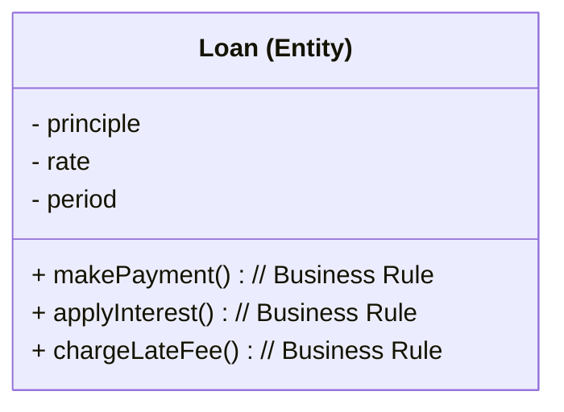
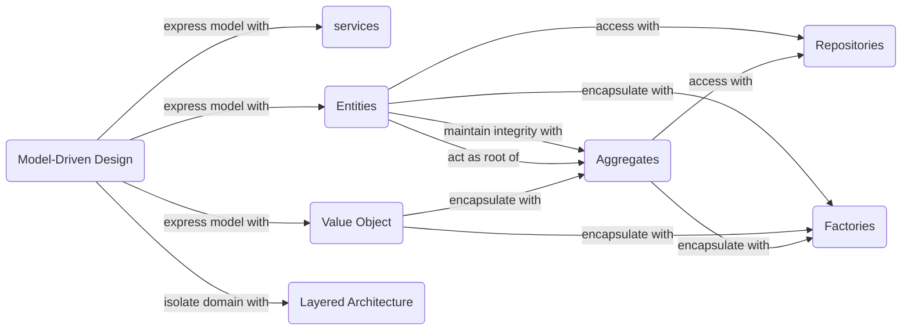
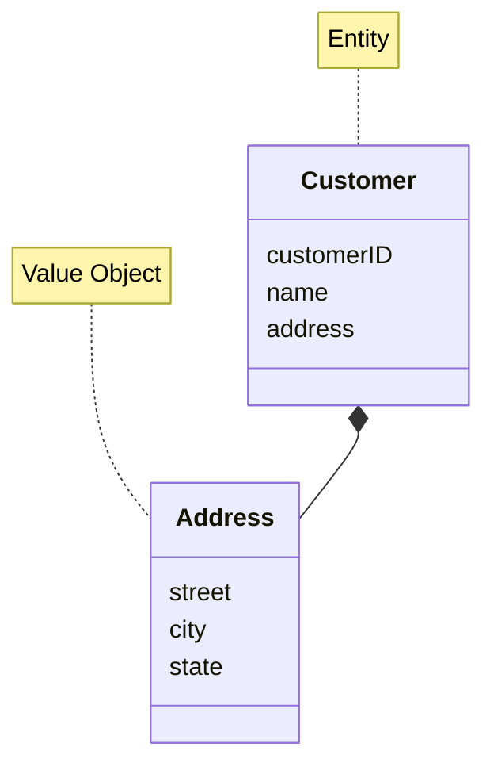

# Axioms

- software design is not a solid stuff
  - designing software architecture never ends
  - it is changing over development
- the primary purpose of architecture is to support the life cycle of the system
  - good architecture makes the system easy to understand, easy to develop, easy to maintain, and easy to deploy
  - the ultimate goal is to minimize the lifetime cost of the system and to maxmize programmer productivity
- the architecture of the system should elevate the use cases, the features, and the required behaviours of the system to first-class entities that are visible landmarks for the developers
- good architecture centered on use cases so that architects can safely describe the structures that support those use cases without commiting to frameworks, tools, and environments

# Software Architecture

- Structure
  - type of architecture style
    - microservice
    - layered
    - microkernel
- Architecture Charactaristics
  - success criteria of a system
    - availability
    - reliability
    - testability
    - scalability
    - security
    - agility
    - fault tolerance
    - elasticity
    - receverability
    - performance
    - deployablility
    - learnability
- Architecture Decision
  - rules for how a system should be constructed
- Design Principles
  - a guideline

# Domain

- subject area to which users applies the program
- subject area of the problem we solve using software

# Model

- simplification
- abstraction
  - filter out extraneous details
- effective modeling
  - knowledge crunching
  - cultivating a language based on the model
    - ubiquitous language
      - changes in the ubiquitous language are changes to the model
  - iteration
    - software development is all design
- don't just model reality (e.g. actual manual operations that will be automated by software/system) as is
  - model them from the perspective of software/system too

# SOLID Principles

suggest how to arrange functions and data structures into classes, and how those classes should be interconnected to design the mid-level (module level) software architectures that
- tolerate change
- are easy to undarstand
- are reusable in many software systems

## SRP; Single Responsibility Principle

- a module should be responsible to one, and only one, actor
  - actor: group of user or stakeholder who wants the system changed in the same way
- a moule should NOT have multiple reasons to change

## OCP; Open-Closed Principle

- a software architect should be open for extension but closed for modification
- if SRP is obeyed, a feature extension won't affect to modules for other features
- associated with CCP

## LSP; Liskov Substitution Principle
  - polymorphism

## ISP; Interface Segregation Principle

- avoid depending on things that they don't use
- have clear abstraction/concept of the module

## DIP; Dependency Inversion Principle

- implement interfaces for the high-level module which uses lower-level modules
- lower-level modules should NOT know the implementation details of higher-level modules
- have lower-level modules obey the interfaces
  - now we can have inverted dependency from lower-level to higher-level without knowledge about implemetation details of higher-level module

# Components

## Component-level Principles

### REP; Reuse/Release Equivalence Principle

- the granule of reuse is the granule of release

### CCP; Common Closure Principle

- component-level SRP
  - a component should NOT have multiple reasons to change

### CRP; Common Reuse Principle

- component-level IRP

## Component Dependencies

- component structure cannot be designed from the top down
  - component dependencies graph is created for the first time if it reached the time dependency management was necessary
  - component dependencies graphs is for mapping to buildability and maintainability of the application; not for describing the function of the application
### ADP; Asynclic Dependencies Principle

- allow no cycles in the component dependency graph

### SDP; Stable Dependencies Principle

- depend in the direction of stability
- ensure that modules that are intended to be easy to change are not depended on by modules that are harder to change

### SAP; Stable Abstraction Principle

- a component should be as abstract as it is stable
- SDP + SAP -> dependencies run in the direction of abstraction

# Business Rules

- Critical Business Rules
  - make or save the business money
  - some of them are purelly irrespective of whether they were implemented on a computer
- Entity
  - Critical Business Data
    - data required by critical business rules
  - generalized concept; not *application-specific*
- Use Cases
  - define *application-specific* business rules
    - automated operation to make or save the business money
    - at lower-level than Entities since Use Cases depend on the application/system; not generalized as much as Entities
  - e.g. apply an estimation (validation) to user info for loan then create Customer entity if acceptable
  - have input and ouput
    - but should not depend on how input and output are delivered
      - e.g. HTTP request and response, HTML, SQL

# Humble Objects

- separate behaviours into tastables and non-testables
- from the uesr's point of view, an object is simply a set of operations; an object represent behaviours
  - becaues users cannot see private fields

# Model-Driven Design

# Layered Architecture

- User Interface (or Presentation Layer)
- Application Layer
  - services
  - not contain business rules or knowledge
  - not have state reflecting business situation
  - only coordinates tasks and delegates work to collaborations of domain objects in the next layer down
- Domain Layer (or Model Layer)
  - business situation
  - business rules
  - control and use state reflecting the business situation
- Infrastructure Layer
  - ORM

## Entities

- distinguished by its identity
  - guaranteed the uniqueness
- need to maintain the life cycle
- e.g. user

## Value Objects

- representing a descriptive aspect of the domain with no conceptual identity
  - representing elements of the design that we care about only for *what* they are, not *who* or *which* they are
- immutable
- disposable
- e.g.
  - attributes of an Entity
  - used as parameters in messages between objects

 

# Referencies

- Clearn Architecture
- Domain-Driven Design
- Fundamentals of Software Architecture
- A Philosophy of Software Design
