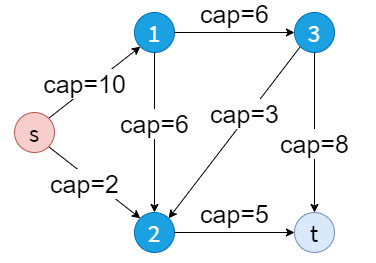
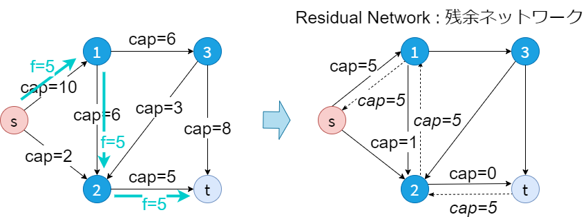
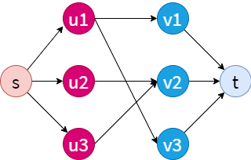

# Flow Networks

## Ford-Fulkerson

- determine maximum flow
- $O(F \lvert E \rvert)$




```txt title="test1.txt"
5 7 0 4
0 1 10
0 2 2
1 2 6
1 3 6
2 4 5
3 2 3
3 4 8
11
```

```cpp title="O(F|E|) / C++"
#include <fstream>
#include <memory.h>
#include <stdio.h>
#include <vector>

#define MAX_N 100
#define INF 1'000'000'000

using namespace std;

struct Edge {
  int v, cap, rev;
};

int n, m, s, t;
vector<Edge> G[MAX_N];
bool used[MAX_N];

void add_edge(int u, int v, int cap) {
  G[u].push_back(Edge{v, cap, G[v].size()});
  G[v].push_back(Edge{u, 0, G[u].size() - 1});
}

int dfs(int u, int t, int f) {
  if (u == t) {
    return f;
  }
  used[u] = true;
  for (int i = 0; i < G[u].size(); ++i) {
    Edge &e = G[u][i];
    if (!used[e.v] && e.cap > 0) {
      int d = dfs(e.v, t, min(f, e.cap));
      if (d > 0) {
        e.cap -= d;
        G[e.v][e.rev].cap += d;
        return d;
      }
    }
  }
  return 0;
}

int max_flow(int s, int t) {
  int res = 0;
  for (;;) {
    memset(used, 0, sizeof(used));
    int f = dfs(s, t, INF);
    if (f == 0) {
      return res;
    }
    res += f;
  }
}

void solve() {
  int res = max_flow(s, t);
  printf("%d\n", res);
}

int main() {
  ifstream ifs("../testset/maximum_traffic/test1.txt");
  ifs >> n >> m >> s >> t;
  for (int i = 0; i < m; ++i) {
    int u, v, cap;
    ifs >> u >> v >> cap;
    add_edge(u, v, cap);
  }
  solve();
}
```

```python title="O(F|E|) / Python"
INF = int(1e9)


def ns(f):
    return next(f).strip()


class Edge:
    def __init__(self, v, cap, rev):
        self.v = v
        self.cap = cap
        self.rev = rev


with open("../testset/maximum_traffic/test1.txt", 'r') as f:
    n, m, s, t = map(int, ns(f).split())
    G = [[] for _ in range(n)]

    def add_edge(u, v, cap):
        global G
        G[u].append(Edge(v, cap, len(G[v])))
        G[v].append(Edge(u, 0, len(G[u]) - 1))

    for _ in range(m):
        add_edge(*map(int, ns(f).split()))


def dfs(u, t, f, used):
    if u == t:
        return f
    used[u] = True
    for e in G[u]:
        if not used[e.v] and e.cap > 0:
            d = dfs(e.v, t, min(f, e.cap), used)
            if d > 0:
                e.cap -= d
                G[e.v][e.rev].cap += d
                return d
    return 0


def max_flow(s, t):
    res = 0
    while True:
        used = [False] * n
        f = dfs(s, t, INF, used)
        if f == 0:
            return res
        res += f


print(max_flow(s, t))
```

## Bipartite Matching



```txt title="text2.txt"
3 3 4
1 1
1 3
2 2
3 2
2
```

```cpp title="C++"
#include <fstream>
#include <stdio.h>
#include <vector>

#define MAX_N 1000
#define MAX_M 1000
#define MAX_V MAX_N + MAX_M

using namespace std;

int N, M, K;
vector<int> G[MAX_V];
int match[MAX_V];
bool used[MAX_V];

void add_edge(int u, int v) {
  G[u].push_back(v);
  G[v].push_back(u);
}

bool dfs(int u) {
  used[u] = true;
  for (auto v : G[u]) {
    int _u = match[v];
    if (_u < 0 || (!used[_u] && dfs(_u))) {
      // u is computers, _u is computer which is already assigned to work v, v is work
      // increase num of matching only when w < 0 i.e. _u find a new work.
      match[u] = v;
      match[v] = u;
      return true;
    }
  }
  return false;
}

int bipartite_matching() {
  int res = 0;
  fill(match, match + N + M, -1);
  for (int u = 0; u < N; ++u) { // only left side vertexes
    if (match[u] < 0) {
      fill(used, used + N + M, 0);
      if (dfs(u)) {
        ++res;
      }
    }
  }
  return res;
}

void solve() { printf("%d\n", bipartite_matching()); }

int main() {
  ifstream ifs("../testset/work_assignment/test2.txt");
  ifs >> N >> M >> K;
  for (int i = 0; i < K; ++i) {
    int u, v;
    ifs >> u >> v;
    --u;
    --v;
    add_edge(u, N + v);
    add_edge(N + v, u);
  }
  solve();
}
```

```python title="Python"
def ns(f):
    return next(f).strip()


with open("../testset/work_assignment/test1.txt", 'r') as f:
    N, M, K = map(int, ns(f).split())
    V = N + M
    G = [[] for _ in range(V)]
    for _ in range(K):
        u, v = map(int, ns(f).split())
        u -= 1
        v -= 1
        G[u].append(N + v)
        G[N + v].append(u)


def dfs(u, used, match):
    used[u] = True
    for v in G[u]:
        _u = match[v]
        if _u < 0 or (not used[_u] and dfs(_u, used, match)):
            match[u] = v
            match[v] = u
            return True
    return False


def bipartite_matching():
    res = 0
    match = [-1] * V
    for u in range(N):
        if match[u] < 0:
            used = [False] * V
            if dfs(u, used, match):
                res += 1
    return res


print(bipartite_matching())
```
