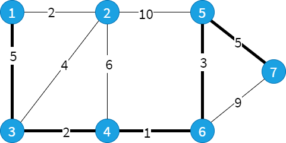
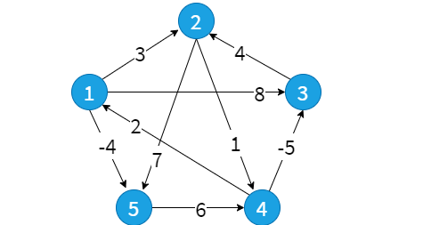
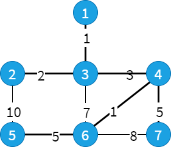

# Graph Algorithms

## Single Source Shortest Paths

### Bellman-Ford Algorithm

- $O(\lvert V \rvert \lvert E \rvert)$
- **detect negative loop**
- relax edges for $\lvert V \rvert - 1$
  - see all vertexes in each loop
- based on *triangle inequality*



```txt title="test1.txt"
7 10 1 7
1 2 2
1 3 5
2 3 4
2 4 6
2 5 10
3 4 2
4 6 1
5 6 3
5 7 5
6 7 9
16
```

```cpp title="C++"
#include <fstream>
#include <stdio.h>
#include <vector>

#define MAX_N 10'000
#define MAX_K 10'000
#define INF 1'000'000'000

using namespace std;

struct Edge {
  int u, v, weight;
};

int N, K, S, G;
int dist[MAX_N], path[MAX_N];
Edge E[MAX_K];

void init(int s) {
  for (int i = 0; i < N; ++i) {
    dist[i] = INF;
    path[i] = -1;
  }
  dist[s] = 0;
}

void relax(int u, int v, int weight) {
  if (dist[v] > dist[u] + weight) {
    dist[v] = dist[u] + weight;
    path[v] = u;
  }
}

bool bellman_ford() {
  for (int i = 0; i < N - 1; ++i) {
    for (auto e : E) {
      relax(e.u, e.v, e.weight);
    }
  }
  for (auto e : E) {
    if (dist[e.v] > dist[e.u] + e.weight) {
      return false;
    }
  }
  return true;
}

void print_path(int s, int v) {
  if (s == v) {
    printf("%d", s + 1);
  } else if (v < 0) {
    printf("\n No path");
  } else {
    print_path(s, path[v]);
    printf("->%d", v + 1);
  }
}

int main() {
  ifstream ifs("../testset/single_source_shortest_path/test1.txt");
  ifs >> N >> K >> S >> G;
  --S;
  --G;
  for (int i = 0; i < K * 2; i += 2) {
    int u, v, weight;
    ifs >> u >> v >> weight;
    --u;
    --v;
    E[i] = Edge{u, v, weight};
    E[i + 1] = Edge{v, u, weight};
  }
  init(S);
  if (bellman_ford()) {
    printf("dist=%d\n", dist[G]);
    printf("path=");
    print_path(S, G);
    printf("\n");
  } else {
    printf("detect negative loop\n");
  }
}

// dist=16
// path=1->3->4->6->5->7
```

```python title="Python"
INF = float('inf')


def ns(f):
    return next(f).strip()


class Edge:
    def __init__(self, u, v, weight):
        self.u = u
        self.v = v
        self.weight = weight


with open("../testset/single_source_shortest_path/test1.txt", 'r') as f:
    N, K, S, T = map(int, ns(f).split())
    S -= 1
    T -= 1
    E = []
    for _ in range(K):
        u, v, weight = map(int, ns(f).split())
        u -= 1
        v -= 1
        E.append(Edge(u, v, weight))
        E.append(Edge(v, u, weight))
dist = [INF] * N
dist[S] = 0
path = [-1] * N


def relax(u, v, weight):
    global dist, path
    if dist[v] > dist[u] + weight:
        dist[v] = dist[u] + weight
        path[v] = u


def bellman_ford():
    # return True if the graph has negative loops.
    for _ in range(N - 1):
        for e in E:
            relax(e.u, e.v, e.weight)

    for e in E:
        if dist[e.v] < dist[e.u] + e.weight:
            return False
    return True


def _print_path(s, v):
    if s == v:
        print(s + 1, end='')
    elif v < 0:
        print('\nNo path', end='')
    else:
        _print_path(s, path[v])
        print(f"->{v + 1}", end='')


def print_path(s, v):
    _print_path(s, v)
    print()


bellman_ford()
print(f"shortest distance={dist[T]}")
print("shortest path=", end='')
print_path(S, T)

# shortest distance=16
# shortest path=1->3->4->6->5->7
```

### Dijkstra's Algorithm

- $O(V^2)$ -> $O(\lvert E \rvert log \lvert V \rvert)$ (used heap queue)
- use priority queue
  - see only the most nearest vertex

```cpp title="C++"
#include <fstream>
#include <queue>
#include <stdio.h>
#include <vector>

#define MAX_N 10'000
#define MAX_K 10'000
#define INF 1'000'000'000

using namespace std;

typedef pair<int, int> P;

struct Edge {
  int u, v, weight;
  Edge(int u, int v, int weight) : u(u), v(v), weight(weight) {}
};

int N, K, S, T;
vector<Edge> G[MAX_N];
int dist[MAX_N], path[MAX_N];

void init(int s) {
  fill(dist, dist + N, INF);
  fill(path, path + N, -1);
  dist[s] = 0;
}

void dijkstra(int s) {
  init(s);
  priority_queue<P, vector<P>, greater<P>> q;
  q.push(P(0, s));
  while (!q.empty()) {
    P p = q.top();
    q.pop();
    int u = p.second;
    if (dist[u] < p.first) {
      continue;
    }
    for (auto e : G[u]) {
      if (dist[e.v] > dist[u] + e.weight) {
        // relax
        dist[e.v] = dist[u] + e.weight;
        path[e.v] = u;
        q.push(P(dist[e.v], e.v));
      }
    }
  }
}

void _print_path(int s, int v) {
  if (s == v) {
    printf("%d", s + 1);
  } else if (v < 0) {
    printf("No path\n");
  } else {
    _print_path(s, path[v]);
    printf("->%d", v + 1);
  }
}

void print_path(int s, int v) {
  _print_path(s, v);
  printf("\n");
}

int main() {
  ifstream ifs("../testset/single_source_shortest_path/test1.txt");
  ifs >> N >> K >> S >> T;
  --S;
  --T;
  for (int i = 0; i < K; ++i) {
    int u, v, weight;
    ifs >> u >> v >> weight;
    --u;
    --v;
    G[u].emplace_back(u, v, weight);
    G[v].emplace_back(v, u, weight);
  }
  dijkstra(S);
  printf("shortest distance=%d\n", dist[T]);
  printf("shortest path=");
  print_path(S, T);
}

// shortest distance=16
// shortest path=1->3->4->6->5->7
```

```python title="Python"
from heapq import heapify, heappop, heappush


INF = float('inf')


def ns(f):
    return next(f).strip()


class Edge:
    def __init__(self, u, v, weight):
        self.u = u
        self.v = v
        self.weight = weight


with open("../testset/single_source_shortest_path/test1.txt", 'r') as f:
    N, K, S, T = map(int, ns(f).split())
    S -= 1
    T -= 1
    G = [[] for _ in range(N)]
    for _ in range(K):
        u, v, weight = map(int, ns(f).split())
        u -= 1
        v -= 1
        G[u].append(Edge(u, v, weight))
        G[v].append(Edge(v, u, weight))

dist = [INF] * N
dist[S] = 0
path = [-1] * N


def dijkstra():
    global dist, path
    q = [[0, S]]
    heapify(q)
    while len(q) > 0:
        p = heappop(q)
        u = p[1]
        if dist[u] < p[0]:
            continue
        for e in G[u]:
            if dist[e.v] > dist[u] + e.weight:
                dist[e.v] = dist[u] + e.weight
                path[e.v] = u
                heappush(q, [dist[e.v], e.v])


def _print_path(s, v):
    if s == v:
        print(s + 1, end='')
    elif v < 0:
        print('\nNo path', end='')
    else:
        _print_path(s, path[v])
        print(f"->{v + 1}", end='')


def print_path(s, v):
    _print_path(s, v)
    print()


dijkstra()
print(f"shortest distance={dist[T]}")
print("shortest path=", end='')
print_path(S, T)

# shortest distance=16
# shortest path=1->3->4->6->5->7
```


## All Pairs Shortest Paths

### Warshall-Floyd Algorithm

- use DP to consider a path from $i$ to $j$ is through $k$ or not
  - which more shorter is path through $k$ or not



```txt title="test1.txt"
5 9
1 2 3
1 3 8
1 5 -4
2 4 1
2 5 7
3 2 4
4 1 2
4 3 -5
5 4 6
0 1 -3 2 -4
3 0 -4 1 -1
7 4 0 5 3
2 -1 -5 0 -2
8 5 1 6 0
```

```cpp title="C++"
#include <algorithm>
#include <fstream>
#include <iostream>
#include <stdio.h>

#define MAX_N 1'000
#define INF 1'000'000'000

using namespace std;

int N, K;
int d[MAX_N][MAX_N];

void warshall_floyd() {
  for (int k = 0; k < N; ++k) {
    for (int i = 0; i < N; ++i) {
      for (int j = 0; j < N; ++j) {
        d[i][j] = min(d[i][j], d[i][k] + d[k][j]);
      }
    }
  }
}

int main() {
  ifstream ifs("../testset/all_pairs_shortest_path/test1.txt");
  ifs >> N >> K;
  for (int i = 0; i < N; ++i) {
    for (int j = 0; j < N; ++j) {
      if (i == j) {
        d[i][j] = 0;
      } else {
        d[i][j] = INF;
      }
    }
  }
  for (int i = 0; i < K; ++i) {
    int u, v, weight;
    ifs >> u >> v >> weight;
    --u;
    --v;
    d[u][v] = weight;
    // if non-direction graph add d[v][u]
    // d[v][u] = weight;
  }
  warshall_floyd();
  for (int i = 0; i < N; ++i) {
    for (int j = 0; j < N; ++j) {
      printf("%d ", d[i][j]);
    }
    printf("\n");
  }
}
```

```python title="Python"
INF = float('inf')


def ns(f):
    return next(f).strip()


with open("../testset/all_pairs_shortest_path/test1.txt", 'r') as f:
    N, K = map(int, ns(f).split())
    d = [[0 if i == j else INF for j in range(N)] for i in range(N)]
    for _ in range(K):
        u, v, weight = map(int, ns(f).split())
        u -= 1
        v -= 1
        d[u][v] = weight
        # if non-direction graph add d[v][u]
        # d[v][u] = weight


def warshall_floyd():
    global d
    for k in range(N):
        for i in range(N):
            for j in range(N):
                d[i][j] = min(d[i][j], d[i][k] + d[k][j])


warshall_floyd()
for _d in d:
    print(' '.join(map(str, _d)))
```


## MST: Minimum Spanning Tree

### Kruscal's Algorithm

- be similar to Bellman-Ford Algorithm
- $O(\lvert E \rvert log \lvert V \rvert)$
- use *Union-Find Tree*
- add vertexes of the min weight edge into tree repeatedly if the tree doesn't include the vertexes



```txt title="test1.txt"
7 9
1 3 1
2 3 2
2 5 10
3 4 3
3 6 7
4 6 1
4 7 5
5 6 5
6 7 8
17
```

```cpp title="C++"
#include <algorithm>
#include <fstream>
#include <memory.h>
#include <stdio.h>

#define MAX_N 10'000
#define MAX_K 10'000

using namespace std;

struct Edge {
  int u, v, weight;
};

int N, K, ans;
int par[MAX_N], rnk[MAX_N]{};
Edge E[MAX_K];

void init() {
  for (int i = 0; i < N; ++i) {
    par[i] = i;
  }
}

int find(int u) {
  if (par[u] == u) {
    return u;
  }
  return par[u] = find(par[u]);
}

void unite(int u, int v) {
  u = find(u);
  v = find(v);
  if (u == v) {
    return;
  }
  if (rnk[u] < rnk[v]) {
    par[u] = v;
  } else {
    par[v] = u;
    if (rnk[u] == rnk[v]) {
      ++rnk[u];
    }
  }
}

bool same(int u, int v) { return find(u) == find(v); }

int kruscal() {
  int res = 0;
  sort(E, E + K, [](const Edge &e1, const Edge &e2) { return e1.weight < e2.weight; });
  init();
  for (auto e : E) {
    if (!same(e.u, e.v)) {
      res += e.weight;
      unite(e.u, e.v);
    }
  }
  return res;
}

int main() {
  ifstream ifs("../testset/minimum_spanning_tree/test1.txt");
  ifs >> N >> K;
  for (int i = 0; i < K; ++i) {
    int u, v, weight;
    ifs >> u >> v >> weight;
    E[i] = Edge{--u, --v, weight};
  }
  ans = kruscal();
  printf("%d\n", ans);
}
```

```python title="Python"
def ns(f):
    return next(f).strip()


class Edge:
    def __init__(self, u, v, weight):
        self.u = u
        self.v = v
        self.weight = weight


with open("../testset/minimum_spanning_tree/test1.txt", 'r') as f:
    N, K = map(int, ns(f).split())
    E = []
    for _ in range(K):
        u, v, weight = map(int, ns(f).split())
        E.append(Edge(u - 1, v - 1, weight))

par = [i for i in range(N)]
rnk = [0] * N


def find(u):
    global par
    if par[u] == u:
        return u
    par[u] = find(par[u])
    return par[u]


def unite(u, v):
    global par, rnk
    u = find(u)
    v = find(v)
    if u == v:
        return
    if rnk[u] < rnk[v]:
        par[u] = v
    else:
        par[v] = u
        if rnk[u] == rnk[v]:
            rnk[u] += 1


def same(u, v):
    return find(u) == find(v)


def kruscal():
    res = 0
    E.sort(key=lambda x: x.weight)
    for e in E:
        if not same(e.u, e.v):
            res += e.weight
            unite(e.u, e.v)
    return res


ans = kruscal()
print(ans)
```

### Prim's Algorithm

- be similar to Dijkstra's Algorithm
- use priority queue -> $O(\lvert E \rvert log \lvert V \rvert)$
- add vertex having the shortest distance from added vertexes in the tree into tree repeatedly

```cpp title="C++"
#include <fstream>
#include <queue>
#include <stdio.h>
#include <utility>
#include <vector>

#define MAX_N 10'000
#define MAX_K 10'000

using namespace std;

typedef pair<int, int> P;

struct Edge {
  int u, v, weight;
  Edge(int u, int v, int weight) : u(u), v(v), weight(weight) {}
};

int N, K, ans;
vector<Edge> G[MAX_N];
bool used[MAX_N]{};

int prim() {
  int res = 0;
  used[0] = true;
  priority_queue<P, vector<P>, greater<P>> q;
  for (auto e : G[0]) {
    q.push(P(e.weight, e.v));
  }
  while (!q.empty()) {
    P p = q.top();
    q.pop();
    int u = p.second;
    if (used[u]) {
      continue;
    }
    used[u] = true;
    res += p.first;
    for (auto e : G[u]) {
      if (!used[e.v]) {
        q.push(P(e.weight, e.v));
      }
    }
  }
  return res;
}

int main() {
  ifstream ifs("../testset/minimum_spanning_tree/test1.txt");
  ifs >> N >> K;
  for (int i = 0; i < K; ++i) {
    int u, v, weight;
    ifs >> u >> v >> weight;
    --u;
    --v;
    G[u].emplace_back(u, v, weight);
    G[v].emplace_back(v, u, weight);
  }
  ans = prim();
  printf("%d\n", ans);
}
```

```python title="Python"
from heapq import heapify, heappop, heappush


def ns(f):
    return next(f).strip()


class Edge:
    def __init__(self, u, v, weight):
        self.u = u
        self.v = v
        self.weight = weight


with open("../testset/minimum_spanning_tree/test1.txt", 'r') as f:
    N, K = map(int, ns(f).split())
    G = [[] for _ in range(N)]
    for _ in range(K):
        u, v, weight = map(int, ns(f).split())
        u -= 1
        v -= 1
        G[u].append(Edge(u, v, weight))
        G[v].append(Edge(v, u, weight))

used = [False] * N


def prim():
    global used
    res = 0
    used[0] = True
    q = [[e.weight, e.v] for e in G[0]]
    heapify(q)
    while len(q) > 0:
        p = heappop(q)
        u = p[1]
        if used[u]:
            continue
        used[u] = True
        res += p[0]
        for e in G[u]:
            if not used[e.v]:
                heappush(q, [e.weight, e.v])
    return res


ans = prim()
print(ans)
```
