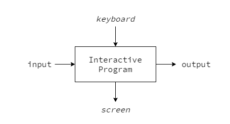
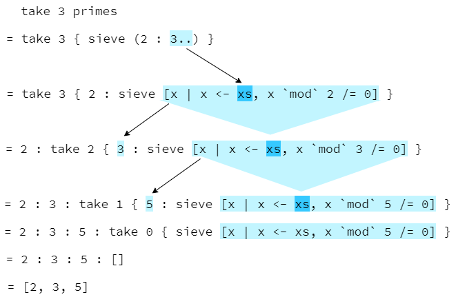

# Fundamentals

## Naming Requirements of Functions

These are *keywords*; reversed words.  

```
case  class  data  default  deriving
do  else  foreign  if  import  in
infix  infixl  infixr  instance  let
module  newtype  of  then  type  where
```


## Standard Prelude

```hs
main = do
  let x = [1, 2, 3, 4, 5]
  print (head x) -- 1
  print (tail x) -- [2, 3, 4, 5]
  print (init x) -- [1, 2, 3, 4]
  print (last x) -- 5
  print (x !! 2) -- 3
  print (take 3 x) -- [1, 2, 3]
  print (drop 3 x) -- [4, 5]
  print (length x) -- 5
  print (sum x) -- 15
  print (product x) -- 120
  print ([1, 2, 3] ++ [4, 5]) -- [1 , 2, 3, 4, 5]
  print (reverse x) -- [5, 4, 3, 2, 1]
```

## Types

A *type* is a collection of related values.  

### Notation 1

`v :: T` means `e` is a value in the type `T`.  

```
False :: Bool
True :: Bool
not :: Bool -> Bool
```

### Notation 2

`e :: T` means evaluation of the expression `e` will produce a value of type `T`.  

```
not False :: Bool
not True :: Bool
not (not False) :: Bool
```

Typing rule

```
f :: A -> B  e :: A
-------------------
      f e -> B
```

### Type Interface and Type Safe

**type interface** that evaluates types under typing rule.  
type interface precedes evaluation of values so Haskell programs are **type safe**.

### Basic Types

|types|description|
|:--:|:---:|
|Bool||
|Char||
|String||
|Int| fixed-precision intergers. the range is $[-2^{63}, 2^{63} - 1]$ |
|Integer|arbitarary-precision integers|
|Float|single-precision floating-point numbers|
|Double|double-precision floating-point numbers|

### List Types

```hs
[['a', 'b'], ['c', 'd', 'e']] :: [[Char]]
```
### Tuple Types
 
*arity*: the number of components in a tuple
- arity zero: `()`; the empty tuple
- arity one: **Not Permitted**
- arity two: *pairs*
- arity three: *triples*

```hs
tp1 = ("Yes", True, 'a') :: (String, Bool, Char)
tp2 = (3, "Blue") :: (Int, String)

main = do
  print (fst tpl) -- 3
  print (snd tpl) -- "Blue"
```

### Function Types

A `function` is mapping from arguments of one type to results of another type.

```hs
add :: (Int, Int) -> Int
add (x, y) = x + y

add (1, 2)  -- 3


zeroto :: Int -> [Int]
zeroto n = [0..n]
```

#### Curried Functions


```hs
add' :: Int -> (Int -> Int)
add' x y = x + y

add' 1 2  -- 3


mult :: Int -> (Int -> (Int -> Int))
mult x y z = x * y * z
```

Don't confuse currying and partial application
- Currying: divide a function into functions with only one argument and nest them.
- Partial Application: create a new function by fixing partial arguments of a original function

```hs
-- currying
add' :: Int -> (Int - > Int)
add' x y = x + y

add' 1 2

-- partial application 1
add'' = add' 1
add'' 2 -- 3

-- partial application 2
add'' y = add (1, y)
add'' 2 -- 3
```

### Polymorphic Types

```hs
fst :: (a, b) -> a
head :: [a] -> a
take :: Int -> [a] -> [a]
zip :: [a] -> [b] -> [(a, b)]
id :: a -> a
```

#### Type Variable

must begin with a lower-case letter

```hs
length :: [a] -> Int
```

### Overloaded Types

contains one or more class constraints

```hs
(+) :: Num a => a -> a -> a
negate :: Num a => a -> a
abs :: Num a => a -> a
```

#### Class Constraint

```
-- C: class name
-- a: type variable (an assined type to `a` is called `instance` of class `C`)
C a
```

## Classes

A *class* is a collection of types that support certain overloaded operatoins; *methods* (e.g. `(==), (/=)` in Eq)

### Eq - equality types

```hs
(==) :: a -> a -> Bool
(/=) :: a -> a -> Bool
```

All the basic types Bool, Char, String, Int, Integer, Float and Double are instances of the Eq class.  
As are list and tuple types, provided that element and component types of the basic types are instances.

### Ord - ordered types

```hs
(<) :: a -> a -> Bool
(<=) :: a -> a -> Bool
(>) :: a -> a -> Bool
(>=) :: a -> a -> Bool
min :: a -> a -> a
max :: a -> a -> a
```

### Show - showable types

```hs
show :: a -> String
```

### Read - readable types

```hs
read :: String -> a
```

### Num - numeric types

```hs
(+) :: a -> a -> a
(-) :: a -> a -> a
(*) :: a -> a -> a
negate :: a -> a
abs :: a -> a signum :: a -> a
```

### Integral - integral types

Types to support the methods of integer division and integer remainder.
*Int* and *Integer* are *instances* of *Integral*.  

```hs
div :: a -> a -> a
mod :: a -> a -> a
```

### Fractional - fractional types

support the methods of fractional division and fractinal reciprocation

```
(/) :: a -> a -> a
recip :: a -> a
```

```hs
> 7.0 / 2.0
3.5

> recip 2.0
0.5
```


## Definning Functions

### Conditional Expressions

```hs
abs :: Int -> Int
abs n = if n >= 0 then n else -n

signum :: Int -> Int
signum n = if n < 0 then -1 else
  if n == 0 then 0 else 1
```

### Guarded Equations

```hs
abs n
  | n >= 0 = n
  | otherwise = - n

signum n
  | n < 0 = -1
  | n == 0 = 0
  | otherwise = 1
```

The symbol `|` is read as *such that*.


### Pattern matching

```hs
not :: Bool -> Bool
not False = True
not True = False

(&&) :: Bool -> Bool -> Bool
True && True = True
_ && _ = False
```

#### Tuple Patterns

```hs
fst :: (a, b) -> a
fst (x, _) = x

snd :: (a, b) -> b
snd (_, y) = y
```

#### List Patterns

matches any list of the same length whose elements all match the corresponding patterns in order.  

```hs
test :: [Char] -> Bool
test ['a', _, _] = True
test _ = False
```

*cons* operator `:` prepends a new element to an existing list.  

```hs
[1, 2, 3]
= 1:[2, 3]
= 1:(2:[3])
= 1:(2:(3:[]))
```

```hs
test :: [Char] -> Bool
test ('a':_) = True
test _ = False

head :: [a] -> a
head (x:_) = x

tail :: [a] -> [a]
tail (_:xs) = xs
```

### Lambda Expressions

```hs
\x -> x + x

> (\x -> x + x) 2
4
```

```hs
add :: Int -> Int -> Int
add x y = x + y
add = \x -> (\y -> x + y)
```

```hs
const :: a -> b -> a
const x _ = x
const x = \_ -> x
```

```hs
odds :: Int -> [Int]
odds n = map f [0..n-1]
  where f x = x * 2 + 1
odds n = map (\x -> x * 2 + 1) [0..n-1]
```

### Operator Sections

- operators: functions with two arguments
- sections: operators formed as `(#)`, `(x #)`, or so

```hs
(#) = \x -> (\y -> x # y)
(x #) = \y -> x # y
(# y) = \x -> x # y
```


## List Comprehensions

$\{x^2 | x \in \{ 1 .. 5 \} \}$

```hs
xs = [x^2 | x <- [1..5]]  -- [1, 4, 9, 16, 25]
```

- `|`: *such that*
- `<-`: *drawn from*
- `x <- [1..5]`: **generator**

```hs
xs2 = [(x, y) | x <- [1, 2, 3,], y <- [4, 5]]
-- [(1, 4), (1, 5), (2, 4), (2, 5), (3, 4), (3, 5)]

xs3 = [(x, y) | y <- [4, 5], x <- [1, 2, 3]]
-- [(1, 4), (2, 4), (3, 4), (1, 5), (2, 5), (3, 5)]

xs4 = [(x, y) | x <- [1..3], y <- [x..3]]
-- [(1, 1), (1, 2), (1, 3), (2, 2), (2, 3), (3, 3)]
```

```hs
concat :: [[a]] -> [a]
concat xss = [x | xs <- xss, x <- xs]

firsts :: [(a, b)] -> [a]
firsts ps = [x | (x, _) <- ps]

length :: [a] -> Int
length xs = sum [1 | _ <- xs]


main = do
  print (concat [[1, 2, 3], [4, 5, 6]]) -- [1,2,3,4,5,6]
  print ([1, 2, 3] ++ [4, 5, 6]) -- [1,2,3,4,5,6]
  print (firsts [(1, 2), (3, 4), (5, 6)]) -- [1, 3, 5]
  print (length [1, 2, 3]) -- 3
```

### Guard

expressions to filter generated values

```hs
evens :: Integral a => a -> [a]
evens n = [x | x <- [0 .. n], even x]

factors :: Integral a => a -> [a]
factors n = [x | x <- [1 .. n], n `mod` x == 0]

prime :: Integral a => a -> Bool
prime n = factors n == [1, n]
{- Note:
  Deciding that a number is prime does not require 
  the `prime` to produce all of its factors, 
  because under lazy evaluation the result `False` is returned 
  as soon as any factor other than one or the number itself is produced.
  e.g. `prime 15` returns `False` when 3 in its factors `[1, 3, 5, 15]` is produced in `factors`.
-}

primes :: Integral a => a -> [a]
primes n = [x | x <- [2 .. n], prime x]

find :: Eq a1 => a1 -> [(a1, a2)] -> [a2]
find k t = [v | (k', v) <- t, k == k']

main = do
  print (evens 10) -- [0,2,4,6,8,10]
  print (factors 12) -- [1,2,3,4,6,12]
  print (prime 15) -- False
  print (prime 7) -- True
  print (primes 40) -- [2,3,5,7,11,13,17,19,23,29,31,37]
  print (find 'b' [('a', 1), ('b', 2), ('c', 3), ('b', 4)]) -- [2, 4]
```

### zip function

```hs
pairs :: [b] -> [(b, b)]
pairs xs = zip xs (tail xs)

sorted :: Ord a => [a] -> Bool
sorted xs = and [x <= y | (x, y) <- pairs xs]

positions :: (Num a1, Enum a1, Eq a2) => a2 -> [a2] -> [a1]
positions x xs = [i | (x', i) <- zip xs [0 ..], x == x']

main = do
  print (zip ['a', 'b', 'c'] [1, 2, 3, 4]) -- [('a',1),('b',2),('c',3)]
  print (pairs [1, 2, 3, 4]) -- [(1,2),(2,3),(3,4)]
  print (sorted [1, 2, 3, 4]) -- True
  print (sorted [1, 3, 2, 4]) -- False
  print (positions False [True, False, True, False]) -- [1, 3]
```

### String comprehensions

*String* is a list of *Char*

```hs
lowers :: [Char] -> Int
lowers xs = length [x | x <- xs, x >= 'a' && x <= 'z']

count :: Eq a => a -> [a] -> Int
count x xs = length [x' | x' <- xs, x == x']

main = do
  print ("abcde" !! 2) -- 'c'
  print (take 3 "abcde") -- "abc"
  print (length "abcde") -- 5
  print (zip "abc" [1, 2, 3, 4]) -- [('a',1),('b',2),('c',3)]

  print (lowers "Haskell") -- 6
  print (count 's' "Mississippi") -- 4
```

## Recursive Functions

```hs
fac :: Int -> Int
fac 0 = 1
fac n = n * fac (n - 1)

(*) :: Int -> Int -> Int
m * 0 = 0
m * n = m + (m * (n - 1))
```

### Recursion on Lists

```hs
product :: Num a => [a] -> a
product [] = 1
product (n:ns) = n * product ns

length :: [a] -> Int
length [] = 1
length (_:xs) = 1 + length xs

reverse :: [a] -> a
reverse [] = []
reverse (x:xs) = reverse xs ++ [x]

(++) :: [a] -> [a] -> [a]
[] ++ ys = ys
(x:xs) ++ ys = x:(xs ++ ys)

insert :: Ord a => a -> [a] -> [a]
insert x [] = [x]
insert x (y:ys)
  | x <= y = x:y:ys
  | otherwise = y:insert x ys

-- insertion sort
isort :: Ord a => [a] -> [a]
isort [] = []
isort (x:xs) = insert x (isort xs)
```

### Multiple Arguments

```hs
zip :: [a] -> [a] -> [(a, b)]
zip [] _ = []
zip _ [] = []
zip (x:xs) (y:ys) = (x, y):zip xs ys

drop :: Int -> [a] -> [a]
drop 0 xs = xs
drop _ [] = []
drop n (x:xs) = drop (n - 1) xs
```

### Multiple Recursion

```hs
fib :: Int -> Int
fib 0 = 0
fib 1= 1
fib n = fib (n - 2) + fib (n - 1)

qsort :: Ord a => [a] -> [a]
qsort [] = []
qsort (x:xs) = qsort smaller ++ [x] ++ qsort larger
  where 
    smaller = [a | a <- xs, a <= x]
    larger = [b | b <- xs, b > x]
```

### Mutual Recursion

```hs
even :: Int -> Bool
even 0 = True
even n = odd (n - 1)

odd :: Int -> Bool
odd 0 = False
odd n = even (n - 1)


evens :: [a] -> [a]
evens [] = []
evens (x:xs) = x:odds xs

odds :: [a] -> [a]
odds [] = []
odds (_:xs) = evens xs
```

### Generalizing and Simplifying

```hs
-- before
product :: Num a => [a] -> a
product [] = 1
product (n:ns) = n * product ns

-- after
product :: Num a => [a] -> a
product = foldr (*) 1
```

```hs
-- before
init :: [a] -> [a]
init (x:xs)
  | null xs = []
  | otherwise = x:init xs

-- after
init :: [a] -> [a]
init [_] = []
init (x:xs) = x:init xs
```

## Higher-Order Functions

Functions that take a function as an argument or return a function as a result

### Processing Lists

```hs
-- list conprehension ver.
map :: (a -> b) -> [a] -> [b]
map f xs = [f x | x <- xs]

-- recursive ver.
map :: (a -> b) -> [a] -> [b]
map f [] = []
map f (x : xs) = f x : map f xs


-- list conprehension ver.
filter :: (a -> Bool) -> [a] -> [a]
filter p xs = [x | x <- xs, p x]

-- recursive ver.
filter :: (a -> Bool) -> [a] -> [a]
filter p [] = []
filter p (x : xs)
  | p x = x : filter p xs
  | otherwise = filter p xs


main = do
  print (all even [2, 4, 6, 8]) -- True
  print (any odd [2, 4, 6, 8]) -- False
  print (takeWhile even [2, 4, 6, 7, 8]) -- [2, 4, 6]
  print (dropWhile odd [1, 3, 5, 6, 7]) -- [6, 7]
```

### foldr()

```hs
foldr (#) v [x0, x1, ..., xn] = x0 # (x1 # (... (xn # v)))

f v

-- recursive ver.
foldr :: (a -> b -> b) -> b -> [a] -> b
foldr f v [] = v
foldr f v (x : xs) = f x (foldr f v xs)
```

```hs
sum :: Num a => [a] -> a
-- sum [] = 0
-- sum (x : xs) = x + sum(xs)
sum = foldr (+) 0

product :: Num a => [a] -> a
product = foldr (*) 1

or :: [Bool] -> Bool
or = foldr (||) False

and :: [Bool] -> Bool
and = foldr (&&) True

length :: [a] -> Int
-- length [] = 0
-- length (_:xs) = 1 + length xs
length = foldr (\_ n -> 1 + n) 0


-- snoc is `cons` backwards
snoc :: a -> [a] -> [a]
snoc x xs = xs ++ [x]

reverse :: [a] -> [a]
-- reverse [] = []
-- reverse (x : xs) = reverse xs ++ [x]
reverse :: [a] -> [a]
reverse = foldr snoc []
```

### foldl()

*v* is *accumlator*.  

```hs
foldl (#) v [x0, x1, ..., xn] = (((v # x0) # x1)...) # xn

-- recursive ver.
foldl :: (a -> b -> a) -> a -> [b] -> a
foldl f v [] = v
fold f v (x : xs) = foldl f (v + x) xs
```

```hs
sum' :: Num a => [a] -> a
sum' = sum'' 0
  where
    sum'' v [] = v
    sum'' v (x : xs) = sum'' (v + x) xs

sum :: Num a => [a] -> a
sum = foldl (+) 0

product :: Num a => [a] -> a
product = foldl (*) 1

or :: [Bool] -> Bool
or = foldl (||) False

and :: [Bool] -> Bool
and = foldr (&&) True

length :: [a] -> Int
length = foldl (\n _ -> n + 1) 0

reverse :: [a] -> [a]
reverse = foldl (\xs x -> x : xs) []
```

### Composition Operator

`f . g` is read as *f composed with g* .  

```hs
(.) :: (b -> c) -> (a -> b) -> (a -> c)
f . g = \x -> f (g x)
```

```hs
-- odd n = not (even n)
odd = not . even

-- twice f x = f (f x)
twice = f . f

-- sumsqreven ns = sum (map (^2) (filter even ns))
sumsqreven = sum . map (^2) . filter even
```

```hs
-- identity function; id.f = f, f.id = f
id :: a -> a
id = \x -> x

compose :: [a -> a] -> (a -> a)
compose = foldr (.) id  -- make the composition of a list of functions
```

```hs
-- produces an infinite list
iterate f x = [x, f x, f(f x), f(f(f x)), ...]

iterate (*2) 1  -- [1, 2, 4, 8, ...]


-- repeat :: a -> [a]: procudes an infinite list of copies of a value
repeat 0  -- [0, 0, 0, 0, ...]
take 8 (repeat 0) -- [0, 0, 0, 0, 0, 0, 0, 0] -- lazy evaluation
```


## Type Declarations

```hs
type String = [Char]

type Pos = (Int, Int)
type Trans = Pos -> Pos

type Pair a = (a, a)
type Assoc k v = [(k, v)]

find :: Eq k => k -> Assoc k v -> v
find k t = head [v | (k', v) <- t, k == k']
```

## Data Declarations

- `|` is read as *or*.  
- **constructors** new values of the type (e.g. `False` and `True` are constructors of *Bool*)

```hs
data Bool = False | True
```

```hs
data Move = North | South | East | West

move :: Move -> Pos -> Pos
move North (x, y) = (x, y + 1)
move South (x, y) = (x, y - 1)
move East (x, y) = (x + 1, y)
move West (x, y) = (x - 1, y)

moves :: [Move] -> Pos -> Pos
moves [] p = p
moves (m : ms) p = moves ms (move m p)
```

### Cosntructor Functions

#### vs. normal functions

- have no defining equations and exist as data
- e.g. 
  - `negate 1.0` can be evaluated to -1.0 by definition of negate
  - `Circle 1.0` is already fully evaluated and cannot be further simplified

```hs
-- Circle :: Float -> Shape
-- Rect :: Float -> Float -> Shape
data Shape = Circle Float | Rect Float Float

square :: Float -> Shape
square n = Rect n n

area :: Shape -> Float
area (Circle r) = pi * r ^ 2
area (Rect x y) = x * y
```

type as a argument

```hs
data Maybe a = Nothing | Just a

safediv :: Int -> Int -> Maybe Int
safediv _ 0 = Nothing
safediv m n = Just (m `div` n)

safehead :: [a] -> Maybe a
safehead [] = Nothing
safehead xs = Just (head xs)
```

### Newtype Declarations

newtype declarations are to improve type safety without affecting perfomance.  
it must have *Constructor* such as `N` in below example.  

```hs
newtype Nat = N Int

type Nat = Int
data Nat = N Int
```

#### vs. type

- Using newtype rather than type means that `Nat` and `Int` are different types rather than synonyms
- The type system of Haskell ensures that they cannot accidentally be mixed up in programs

#### vs. data

- Using newtype rather than data brings an efficiency benefit
- newtype constructors such as `N` do not incur any cost when programs are evaluated, as they are automatically removed by the compiler once type checking is completed


### Recursive Types

```hs
data Nat = Zero | Succ Nat

nat2int :: Nat -> Int
nat2int Zero = 0
nat2int (Succ n) = 1 + nat2int n

int2nat :: Int -> Nat
int2nat 0 = Zero
int2nat n = Succ (int2nat (n - 1))

add :: Nat -> Nat -> Nat
add m n = int2nat (nat2int m + nat2int n)

add' :: Nat -> Nat -> Nat
add' Zero n = n
add' (Succ m) n = Succ (add' m n)


{- e.g. 2 + 1
    add (Succ (Succ Zero)) (Succ Zero)
  = (Succ add (Succ Zero) (Succ Zero))
  = Succ (Succ (add Zero (Succ Zero)))
  = Succ (Succ (Succ Zero))
-}
```

```hs
data Tree a = Leaf a | Node (Tree a) a (Tree a)

t :: Tree Int
t = Node (Node (Leaf 1) 3 (Leaf 4)) 5 (Node (Leaf 6) 7 (Leaf 9))

flatten :: Tree a -> [a]
flatten (Leaf x) = [x]
flatten (Node l x r) = flatten l ++ [x] ++ flatten r

occurs :: Eq a => a -> Tree a -> Bool
occurs x (Leaf y) = x == y
occurs x (Node l y r) = x == y || occurs x l || occurs x r

occurs' :: Ord a => a -> Tree a -> Bool
occurs' x (Leaf y) = x == y
occurs' x (Node l y r)
  | x == y = True
  | x < y = occurs' x l
  | otherwise = occurs' x r
```


## Class and Instance Declarations

- type `a` is an instance of the class `Eq`
- types of instance must support functions; `(==)`, `(/=)`
- `(/=)` is defined as *default definition*, so declaring an instance only requires a definition of `(==)`

```hs
class Eq a where
  (==), (/=) :: a -> a -> Bool
  x /= y = not (x == y)

instance Eq Bool where
  False == False = True
  True == True = True
  _ == _ = False
```

- type `a` to be instance of class `Ord` must be an instance of class `Eq`

```hs
class Eq a => Ord a where
  (<), (<=), (>), (>=) :: a -> a -> Bool
  min, max :: a -> a -> a
  min x y
    | x <= y = x
    | otherwise = y
  max x y
    | x <= y = y
    | otherwise = x

instance Ord Bool where
  False < True = True
  _ < _ = False

  b <= c = (b < c) || (b == c)
  b > c = c < b
  b >= c = c <= b
```


## Derived Instances

```hs
data Bool = False | True  -- this order is reflected on False < True
  deriving (Eq, Ord, Show, Read)
```

## Interactive Programming

Interactive programs has side effects such as additional inputs and outputs while the program is running.  



Haskell treats an interactive program as a pure function that takes the current *state of world* as its arguments, and produces a modified world as its result  

Expressions of type IO a are called *actions*  
- type IO Char: type of actions that return a character
- type IO (): type of actions that return the empty tuple `()` as a dummy result value

```hs
type IO = World -> World

type IO a = World -> (a, World)

type Char -> IO Int -- means type Char -> World -> (Int, World)
```

### Basic Actions

```hs
getChar :: IO Char

putChar :: Char -> IO ()

return :: a -> IO a
```

### Sequencing

- `<-` is called *generator* as with list comprehensions
  - if a value generated by `ai` is unnecessary, generator is abbreviated by `ai` which means `_ <- ai`

```hs
do v1 <- a1
   v2 <- a2
   ...
   vn <- an
   return (f v1 v2 ... vn)
```

```hs
act :: IO (Char, Char)
act = do x <- getChar
         getChar
         y <- getChar
         return (x, y)
```

### Derived primitives

action primitives in the standard prelude
- getLine: read chars until `\n`
- putStr: without `\n`
- putStrLn: with `\n`

```hs
getLine :: IO String
getLine = do x <- getChar
             if x == '\n' then
                return []
             else
                do xs <- getLine
                   return (x : xs)


putStr :: String -> IO ()
putStr [] = return ()
putStr (x : xs) = do putChar x
                     putCStr xs


putStrLn :: String -> IO ()
putStrLn xs = do putStr xs
                 putChar '\n'
```

```hs
strlen :: IO ()
strlen = do putStr "Enter a string: "
            xs <- getLine
            putStr "The string has "
            putStr (show (length xs))
            putStrLn " characters"
```


## Functors

class of types that support a mapping function.

```hs
class Functor f where
  fmap :: (a -> b) -> f a -> f b
```

- `fmap` takes a function of type `a -> b` and a structure of type `f a` whose elements have type `a`
- `fmap` applies the function to each element to give a structure of type `f b` whose elements have type `b`

```hs
instance Functor [] where
  -- fmap :: (a -> b) -> [a] -> [b]
  fmap = map


instance Functor Maybe where
  -- fmap :: (a -> b) -> Maybe a -> Maybe b
  fmap _ Nothing = Nothing
  fmap g (Just x) = Just (g x)

fmap (+1) Nothing     -- Nothing
fmap (*2) (Just 3)    -- Just 6
fmap not (Just False) -- Just True
```

```hs
data Tree a = Leaf | Node (Tree a) (Tree a)
  deriving Show

instance Functor Tree where
  -- fmap :: (a -> b) -> Tree a -> Tree b
  fmap g (Leaf x) = Leaf (g x)
  fmap g (Node l r) = Node (fmap g l) (fmap g r)

fmap length (Leaf "abc")  -- Leaf 3
fmap even (Node (Leaf 1) (Leaf 2))  -- Node (Leaf False) (Leaf True)
```

```hs
instance Functor IO where
  -- fmap :: (a -> b) -> IO a -> IO b
  fmap g mx = do {x <- mx; return (g x)}

fmap show (return True) -- "True"
```

```hs
inc :: [Int] -> [Int]
inc = map (+ 1)

inc' :: Functor f => f Int -> f Int
inc' = fmap (+ 1)

inc' (Just 1) -- Just 2
inc' [1, 2, 3, 4, 5]  -- [2, 3, 4, 5, 6]
inc' (Node (Leaf 1) (Leaf 2)) -- Node (Leaf 2) (Leaf 3)
```

### Functor Laws

```hs
fmap id = id
fmap (g . h) = fmap g . fmap h
```


## Applicatives

### applicative functors; applicative

the class of functors that support `pure` and `<*>` functions

```hs
class Functor f => Applicative f where
  pure :: a -> f a
  (<*>) :: f (a -> b) -> f a -> f b
```

```hs
pure :: a -> f a
(<*>) :: f (a -> b) -> f a -> f b

fmap0 :: a -> f a
fmap0 = pure

fmap1 :: (a -> b) -> f a -> f b
fmap1 = pure g <*> x

fmap2 :: (a -> b -> c) -> f a -> f b -> f c
fmap2 = pure g <*> x <*> y

fmap3 :: (a -> b -> c -> d) -> f a -> f b -> f c -> f d
fmap3 = pure g <*> x <*> y <*> z

...


-- type check. fmap2
-- f (a -> b -> c) -> f a -> f (b -> c)
--     pure g     <*>  x  =      x'

-- f (b -> c) -> f b -> f c
--      x'   <*> y  =  res
```

The applicative style for *Maybe* supports a form of *exceptional* programming in which we can apply pure functions to arguments that may fail without the need to manage the propagation of failure ourselves.  

```hs
instance Applicative Maybe where
  -- pure :: a -> Maybe a
  pure = Just

  -- (<*>) :: Maybe (a -> b) -> Maybe a -> Maybe b
  Nothing <*> _ = Nothing
  (Just g) <*> mx = fmap g mx

pure (+ 1) <*> Just 1           -- Just 2
pure (+) <*> Just 1 <*> Just 2  -- Just 3
pure (+) <*> Nothing <*> Just 2 -- Nothing
```

The applicative sytle for lists supports a form of *non-deteministic* programming in which we can apply pure functions to multi-valued arguments without the need to manage the selection of values or the propagation of failure.  

```hs
instance Applicative [] where
  -- pure :: a -> [a]
  pure x = [x]

  -- (<*>) :: [a -> b] -> [a] -> [b]
  gs <*> xs = [g x | g <- gs, x <- xs]

pure (+ 1) <*> [1, 2, 3]        -- [2, 3, 4]
pure (+) <*> [1] <*> [2]        -- [3]
pure (*) <*> [1, 2] <*> [3, 4]  -- [3, 4, 6, 8]

prods :: [Int] -> [Int] -> [Int]
prods xs ys = [x * y | x <- xs, y <- ys]

prods' :: [Int] -> [Int] -> [Int]
prods' xs ys = pure (*) <*> xs <*> ys
```

The applicative style for IO supports a form of *interactive* programming in which we can apply pure functions to impure arguments without the need to manage the sequencing of actions or the extranction of result values.  

```hs
instance Applicative IO where
  -- pure :: a -> IO a
  pure = return

  -- (<*>) :: IO (a -> b) -> IO a -> IO b
  mb <*> mx = do {g <- mg; x <- mx; return (g x)}

getChars :: Int -> IO String
getChars 0 = return []
getChars n = pure (:) <*> getChar <*> getChars (n - 1)
```

```hs
sequenceA :: Applicative f => [f a] -> f [a]
sequenceA [] = pure []
sequenceA (x : xs) = pure (:) <*> x <*> sequecneA xs

getChars :: Int -> IO String
getChars n = sequenceA (replicate n getChar)
```

### Applicative Laws

```hs
pure id <*> x = x -- pure is complemented
pure (g x) = pure g <*> pure x  -- occurences of pure can be combined into one
x <*> pure y = pure (\g -> g y) <*> x -- the order in which we evaluate the two components doesn't matter
x <*> (y <*> z) = (pure (.) <*> x <*> y) <*> z  -- <*> is associative
```

these laws ensure that below expression is evaluated  uniquely.  

```hs
pure g <*> x1 <*> x2 <*> ... <*> xn
```

### Infix ver.

```hs
fmap g x = pure g <*> x
g <$> x = fmap g x

g <$> x1 <*> x2 <*> ... <*> xn
```


## Monads

```hs
class Applicative m => Monad m where
  return :: a -> m a
  (>>=) :: m a -> (a -> m b) -> m b

  return = pure
```

### `>>=` operator

- called *bind*.  
- ensures that such an expression only succeeds if every component $m_i$ in the sequence succeeds

```hs
(>>=) :: Maybe a -> (a -> Maybe b) -> Maybe b
mx >>= f = case mx of
  Nothing -> Nothing
  Just x -> f x
```

```hs
-- Notation 1
m1 >>= \x1 ->
m2 >>= \x2 ->
...
mn >>= \xn ->
f x1 x2 ... xn

-- Notation 2
do x1 <- m1
   x2 <- m2
   ...
   xn <- mn
   f x1 x2 ... xn
```

### Monad Laws

```hs
return x >>= f = f x  -- (return x) >>= f = f x
mx >>= return = mx
(mx >>= f) >>= g = mx >>= (\x -> (f x >>= g)) -- assosiatative
```

### Usecases

applicative style does not fit the pattern of effectful programming such as the function which is the first argument of `<*>` is not pure function.  
- e.g. `safediv` is not a pure function because it returns `Maybe Int`, not `Int`

```hs
data Expr = Val Int | Div Expr Expr

eval :: Expr -> Int
eval (Val n) = n
eval (Div x y) = eval x `div` eval y

eval (Div (Val 1) (Val 0))  -- *** Exception: divide by zero


safediv :: Int -> Int -> Maybe Int
safediv _ 0 = Nothing
safediv n m = Just (n `div` m)

eval' :: Expr -> Maybe Int
eval' (Val n) = Just n
eval' (Div x y) = case eval x of
  Nothing -> Nothing
  Just n -> case eval y of
    Nothing -> Nothing
    Just m -> safediv n m

eval' (Div (Val 1) (Val 0)) -- Nothing


eval' :: Expr -> Maybe Int
eval' (Val n) = pure n
eval' (Div x y) = pure safediv <*> eval x <*> eval y  -- type error
```

apply *monad* then

```hs
instance Monad Maybe where
  -- (>>=) :: Maybe a -> (a -> Maybe b) -> Maybe b
  Nothing >>= _ = Nothing
  (Just x) >>= f = f x

data Expr = Val Int | Div Expr Expr

safediv :: Int -> Int -> Maybe Int
safediv _ 0 = Nothing
safediv n m = Just (n `div` m)

-- Notation 1
eval :: Expr -> Maybe Int
eval (Val n) = Just n
eval (Div x y) =
  eval x >>= \n ->
    eval y >>= \m ->
      safediv n m

-- Notation 2
eval' :: Expr -> Maybe Int
eval' (Val n) = Just n
eval' (Div x y) = do
  n <- eval' x
  m <- eval' y
  safediv n m  
```

```hs
instance Monad [] where
  -- (>>=) :: [a] -> (a -> [b]) -> [b]
  xs >>= f = [y | x <- xs, y <- f x]

pairs :: [a] -> [b] -> [(a, b)]
pairs xs ys =
  xs >>= \x ->
    ys >>= \y ->
      return (x, y)

pairs :: [a] -> [b] -> [(a, b)]
pairs xs ys = do
  x <- xs
  y <- ys
  return (x, y)
```

### The State Monad

```hs
type State = Int  -- state is just an integer value but this can be modified as required
```

#### *state tronsformer*; *ST*

takes an input state as its argument and produces an ouptut state as its result

```hs
type ST = State -> State
type ST a = State -> (a, State) -- returns State with an output of type `a`
type a -> ST b -- type a -> State -> (b, State)
-- takes State with an input of type `a` and returns State with an output of type `b`
```

we want to make *ST* into a monad but types declared using the type mechanism cannot be made into instances of classes.  
so we need to define it using *newtype*.  

```hs
newtype ST a = S (State -> (a, State))

-- removes dummy constructor `S`
app :: ST a -> State -> (a, State)
app (S st) x = st x


instance Functor ST where
  -- fmap :: (a -> b) -> ST a -> ST b
  fmap g st = S (\s -> let (x, s') = app st s in (g x, s'))

instance Applicative ST where
  -- pure :: a -> ST a
  pure x = S (\s -> (x, s))

  -- (<*>) :: ST (a -> b) -> ST a -> ST b
  stf <*> stx =
    S
      ( \s ->
          let (f, s') = app stf s
              (x, s'') = app stx s'
           in (f x, s'')
      )

instance Monad ST where
  -- (>>=) :: ST a -> (a -> ST b) -> ST b
  st >>= f = S (\s -> let (x, s') = app st s in app (f x) s')
```


### Generic Functions

#### mapM()

```hs
-- defined in Control.Monad
mapM :: Monad m => (a -> m b) -> [a] -> m [b]
mapM f [] = return []
mapM f (x : xs) = do
  y <- f x
  ys <- mapM f xs
  return (y : ys)
```

```hs
import Data.Char

conv :: Char -> Maybe Int
conv c
  | isDigit c = Just (digitToInt c)
  | otherwise = Nothing

mapM conv "1234"  -- Just [1, 2, 3, 4]
mapM conv "123a"  -- Nothing
```

#### filterM()

```hs
-- defined in Control.Monad
filterM :: Monad m => (a -> m Bool) -> [a] -> m [a]
filterM p [] = return []
filterM p (x : xs) = do
  b <- p x
  ys <- filter M p xs
  return (if b then x : ys else ys)

filterM (\x -> [True, False]) [1, 2, 3]
-- [[1, 2, 3], [1, 2], [1, 3], [1], [2, 3], [2], [3], []]
```

#### join()

```hs
join :: Monad m => m (m a) -> m a
join mmx = do
  mx <- mmx
  x <- mx
  return x

join [[1, 2], [3, 4], [5, 6]] -- [1, 2, 3, 4, 5, 6]
join (Just (Just 1))  -- Just 1
join (Just Nothing) -- Nothing
join Nothing  -- Nothing
```

## Alternative

```hs
class Applicative f => Alternative f where
  empty :: f a
  (<|>) :: f a -> f a -> f a
```

### Alternative Laws

```hs
empty <|> x = x
x <|> empty = x
x <|> (x <|> y) = (x <|> y) <|> z -- associative
```

### Alternative Instances

```hs
instance Alternative Maybe where
  -- empty :: Maybe a
  empty = Nothing

  -- (<|>) :: Maybe a -> Maybe a -> Maybe a
  Nothing <|> my = my
  (Just x) <|> _ = Just x
```

## Monoids

```hs
class Monoids a where
  mempty :: a
  mappend :: a -> a -> a

  mconcat :: [a] -> a
  mconcat = foldr mappend mempty
```

### Monoid Laws

```hs
mempty `mappend` x = x
x `mappend` mempty = x
x `mappend` (y `mappend` z) = (x `mappend` y) `mappend` z

-- using <> operator
mempty <> x = x
x <> mempty = x
x <> (y <> z) = (x <> y) <> z
```

### Data.Monoid

#### Lists

```hs
instance Monoid [a] where
  -- mempty :: [a]
  mempty = []

  -- (<>) :: [a] -> [a] -> [a]
  mappend = (++)
```

#### Maybe

```hs
instance Monoid a => Monoid (Maybe a) where
  -- mempty :: Maybe a
  mempty = Nothing

  -- (<>) :: Maybe a -> Maybe a -> Maybe a
  Nothing <> my = my
  mx <> Nothing = mx
  Just x <> Just y = Just (x <> y)
```

#### Sum

```hs
newtype Sum a = Sum a
  deriving (Eq, Ord, Show, Read)

getSum :: Sum a -> a
getSum (Sum x) = x


instance Num a => Monoid (Sum a) where
  -- mempty :: Sum a
  mempty = Sum 0

  -- (<>) :: Sum a -> Sum a -> Sum a
  Sum x <> Sum y = Sum (x + y)


mconcat [Sum 2, Sum 3, Sum 4] -- Sum 9
```

#### Product

```hs
newtype Product a = Product a
  deriving (Eq, Ord, Show, Read)

getProduct :: Product a -> a
getProduct (Product x) = x


instance Num a => Monoid (Product a) where
  -- mempty :: Product a
  mempty = Product 1

  -- (<>) :: Product a -> Product a -> Product a
  Product x <> Product y = Product (x * y)


mconcat [Product 2, Product 3, Product 4] -- Product 24
```

#### All

```hs
mconcat [All True, All True, All True]  -- All True
```

#### Any

```hs
mconcat [Any False, Any False, Any False] -- Any False
```


## Foldables


**Note:**  
minimal complete definition for an instance of the *Foldable* class is to define either *foldMap* or *foldr*  

```hs
class Foldable t where
  fold :: Monoid a => t a -> a
  foldMap :: Monoid b => (a -> b) -> t a -> b
  foldr :: (a -> b -> b) -> b -> t a -> b
  foldl :: (a -> b -> a) -> a -> t b -> a

  null :: t a -> Bool
  length :: t a -> Int
  elem :: Eq a => a -> t a -> Bool
  maximum :: Ord a => t a -> a
  minimum :: Ord a => t a -> a
  sum :: Num a => t a -> a
  product :: Num a => t a -> a

  foldr1 :: (a -> a -> a) -> t a -> a
  foldl1 :: (a -> a -> a) -> t a -> a

  toList :: t a -> [a]

  -- default definitions
  null = null . toList
  length = length . toList
  elem x = elem x . toList
  maximum = maximum . toList
  minimum = minimum . toList
  sum = sum . toList
  product = product . toList

  foldr f v = foldr f v . toList
  foldl r v = foldl f v . toList
  foldr1 f = fold1 f . toList
  foldl1 f = fold1 f . toList

  fold = foldMap id
  foldMap f = foldr (mappend . f) mempty
  toList = foldMap (\x -> [x])
```

### List

```hs
instance Foldable [] where
  -- fold :: Monoid a => [a] -> a
  fold [] = mempty
  fold (x : xs) = x <> fold xs

  -- foldMap :: Monoid b => (a -> b) -> [a] -> b
  foldMap _ [] = mempty
  foldMap f (x : xs) = f x <> foldMap f xs

  -- foldr :: (a -> b -> b) -> b -> [a] -> b
  foldr _ v [] = v
  foldr f v (x : xs) = f x (foldr f v xs)

  -- foldl :: (a -> b -> a) -> a -> [b] -> a
  foldl _ v [] = v
  foldl f v (x : xs) = foldl f (f v x) xs


getSum (foldMap Sum [1..10])  -- 55
getProduct (foldMap Product [1..10])  -- 3628800
```

### Tree

```hs
data Tree a = Leaf a | Node (Tree a) (Tree a)
  deriving (Show)

instance Foldable Tree where
  -- fold :: Monoid a => Tree a -> a
  fold (Leaf x) = x
  fold (Node l r) = fold l <> fold r

  -- foldMap :: Monoid b => (a -> b) -> Tree a -> b
  foldMap f (Leaf x) = f x
  foldMap f (Node l r) = foldMap f l <> foldMap f r

  -- foldr :: (a -> b -> b) -> b -> Tree a -> b
  foldr f v (Leaf x) = f x v
  foldr f v (Node l r) = foldr f (foldr f v r) l

  -- foldl :: (a -> b -> a) -> a -> Tree b -> a
  foldl f v (Leaf x) = f v x
  foldl f v (Node l r) = foldl f (foldl f v l) r


tree :: Tree Int
tree = Node (Node (Leaf 1) (Leaf 2)) (Leaf 3)

foldr (+) 0 -- 1 + (2 + (3 + 0))
foldl (+) 0 -- ((0 + 1) + 2) + 3
foldl (+) (Node (Leaf 1) (Leaf 2))  -- 3
toList (Node (Leaf 1) (Leaf 2)) -- [1,2]
```

### Generic Functions

```hs
import Data.Foldable

data Tree a = Leaf a | Node (Tree a) (Tree a)
  deriving (Show)

instance Foldable Tree where
  -- foldMap :: Monoid b => (a -> b) -> Tree a -> b
  foldMap f (Leaf x) = f x
  foldMap f (Node l r) = foldMap f l <> foldMap f r

average :: [Int] -> Int
average ns = sum ns `div` length ns

average' :: Foldable t => t Int -> Int
average' ns = sum ns `div` length ns

main = do
  print (average' [1 .. 10])  -- 5
  print (average' (Node (Leaf 1) (Leaf 3))) -- 2
```

#### and()

```hs
and :: Foldable t => t Bool -> Bool
and = getAll . foldMap All

main = do
  print (and [True, False, True]) -- False
```

#### or()

```hs
or :: Foldable t => t Bool -> Bool
or = getAny . foldMap Any

main = do
  print (or (Node (Leaf True) (Leaf False)))  -- True
```

#### all()

```hs
all :: Foldable t => (a -> Bool) -> t a -> Bool
all p = getAll . foldMap (All . p)

main = do
  print (all even [1, 2, 3])  -- False
```

#### any()

```hs
any :: Foldable t => (a -> Bool) -> t a -> Bool
any p = getAny . foldMap (Any . p)

main = do
  print (any even (Node (Leaf 1) (Leaf 2))) -- True
```

#### concat()

```hs
concat :: Foldable t => t [a] -> [a]
concat = fold

main = do
  print (concat ["ab", "cd", "ef"]) -- "abcdef"
  print (concat (Node (Leaf [1, 2]) (Leaf [3])))  -- [1,2,3]
```


## Traversable

**Note:**  
A definition of either *traverse* or *sequenceA* is needed but *traverse* is prefarable rather than *sequenceA* because default *traverse* definition is unefficient due to passing through the data structure twice, when *fmap* and *sequenceA*.  


```hs
class (Functor t, Foldable t) => Traversable t where
  traverse :: Applicative f => (a -> f b) -> t a -> f (t b)
  traverse g = sequenceA . fmap g

  sequenceA :: Applicative f = t (f a) -> f (t a)
  sequenceA = traverse id

  mapM :: Monad m => (a -> m b) -> t a -> m (t b)
  mapM = traverse

  sequence :: Monad m => t (m a) -> m (t a)
  sequence = sequenceA
```

### List

```hs
instance Traversable [] where
  -- traverse :: Applicative f => (a -> f b) -> [a] -> f [b]
  traverse g [] = pure []
  traverse g (x : xs) = pure (:) <*> g x <*> traverse g xs

dec :: Int -> Maybe Int
dec n = if n > 0 then Just (n - 1) else Nothing

main = do
  print (traverse dec [1, 2, 3])  -- Just [0,1,2]
  print (traverse dec [2, 1, 0])  -- Nothing

  print (sequenceA [Just 1, Just 2, Just 3])  -- Just [1, 2, 3]
  print (sequenceA [Just 1, Nothing, Just 3]) -- Nothing
```

### Tree

```hs
instance Traversable Tree where
  -- traverse :: Applicative f => (a -> f b) -> Tree a -> f (Tree b)
  traverse g (Leaf x) = pure Leaf <*> g x
  traverse g (Node l r) = pure Node <*> traverse g l <*> traverse g r

dec :: Int -> Maybe Int
dec n = if n > 0 then Just (n - 1) else Nothing

main = do
  print (traverse dec (Node (Leaf 1) (Leaf 2))) -- Just (Node (Leaf 0) (Leaf 1))
  print (traverse dec (Node (Leaf 0) (Leaf 1))) -- Nothing

  print (sequenceA (Node (Leaf (Just 1)) (Leaf (Just 2))))  -- Just (Node (Leaf 1) (Leaf 2))
  print (sequenceA (Node (Leaf (Just 1)) (Leaf Nothing))) -- Nothing
```


## Lazy Evaluation

**Lazy evaluation** is the use of *call-by-name* evaluation in conjunction with sharing such as using pointer   

In Haskell, any two different ways of evaluating the same expression will always produce the same final value, provided that they both terminate.  

```hs
inc :: Int -> Int
inc n = n + 1

-- from right
inc (2 * 3)
= { applying * }
inc 6
= { applying inc }
6 + 1
= { applying + }
7

-- from left
inc (2 * 3)
= { applying inc }
(2 * 3) + 1
= { applying * }
6 + 1
= { applying + }
7
```

### call-by-value evaluation

*call-by-name* evaluation is preferable to *call-by-value* for ensuring that evaluation terminates as often as possible.  

$\because$ *call-by-name* evaluation will terminate if there exists any evaluation sequence that terminates for a given expression, and produce the same final value.  

```hs
square :: Int -> Int
square n = n * n
```

```
square (1 + 2)
= { applying square }
(1 + 2) * (1 + 2)
= { applying the first +}
3 * (1 + 2)
= { applying + }  -- redundant reduction but can be resolved by using pointer to copy `(1 + 2)`
3 * 3
= { applying * }
9
```

the following expression terminates in *call-by-name* evaluation.  

```hs
inf :: Int
inf = 1 + inf
```

```
fst (0, inf)
= { applying fst }
0
```

### call-by-name evaluation

```
square (1 + 2)
= { applying + }
square 3
= { applying square }
3 * 3
= { applying * }
9
```

the following expression does not terminate in *call-by-value* evaluation.  

```
fst (0, inf)
= { applying inf }
fst (0, 1 + inf)
= { applying inf }
fst (0, 1 + (1 + inf))
= { applying inf }
...
```

### Modular Programming

Lazy evaluation allows us to separate *control* from *data* in our computations.  

```hs
-- take 3: control
-- ones: data
take 3 ones -- [1,1,1]

-- pattern of without lazy evaluation:
-- need to make (= control) a certain data.
-- cannot separate control from data.
replicate 3 1 -- [1,1,1]
```

*the sieve of Eratosthenes*  

```hs
primes :: [Int]
primes = sieve [2 ..]

sieve :: [Int] -> [Int]
sieve (p : xs) = p : sieve [x | x <- xs, x `mod` p /= 0]

main = do
  print (take 10 primes) -- [2,3,5,7,11,13,17,19,23,29]
  print (takeWhile (< 10) primes) -- [2,3,5,7]
```




### Strict Application

*strict* functions such as built-in arithmetic operator, `*` and `+` cannot be applied until their two arguments have been evaluated to numbers; values  

`f $! x`; `f` is immediately applied to `x` (if x is an expression, after evaluation of x)  

`$!` serves as a stopper for outmost evaluation

```
square $! (1 + 2)
= { applying + }
square $! 3
= { applying $! }
square 3
= { applying square }
3 * 3
= { applying * }
9
```

**strict application is mainly used to improve the space performance of programs.**  

pattern with lazy evaluation  

```hs
sumwith :: Int -> [Int] -> Int
sumwith v [] = v
sumwith v (x : xs) = sumwith (v + x) xs
```

```
sumwith 0 [1, 2, 3]
= { applying sumwith }
sumwith (0 + 1) [2, 3]
= { applying sumwith }
sumwith ((0 + 1) + 2) [3]
= { applying sumwith }
sumwith (((0 + 1) + 2) + 3) []
= { applying sumwith }
((0 + 1) + 2) + 3 -- the length is the same with the original list so sumwith requires much space for evaluation if given a long list.  
= { applying the first + }
(1 + 2) + 3
= { applying the first + }
3 + 3
= { applying + }
6
```

pattern with strict application  

```hs
sumwith :: Int -> [Int] -> Int
sumwith v [] = v
sumwith v (x : xs) = (sumwith $! (v + x)) xs
```

```
sumwith 0 [1, 2, 3]
= { applying sumwith }
(sumwith $! (0 + 1)) [2, 3]
= { applying + }
(sumwith $! 1) [2, 3]
= { applying $! }
sumwith 1 [2, 3]
= { applying sumwith }
(sumwith $! (1 + 2)) [3]
= { applying + }
(sumwith $! 3) [3]
= { applying $! }
sumwith 3 [3]
= { applying sumwith }
(sumwith $! (3 + 3)) []
= { applying + }
(sumwith $! 6) []
= { applying $! }
sumwith 6 []
= { applying sumwith }
6
```

### foldl'

```hs
-- in Data.Foldable

foldl' :: (a -> b -> a) -> a -> [b] -> a
foldl' f v [] = v
foldl' f v (x : xs) = ((foldl' f) $! (f v x)) xs
```

## Reasoning

### Induction

can be used to confirm the logic or propeties of a recursive type or a recursive function is correct.  

e.g.1 (about natural number)

```hs
replicate :: Int -> a -> [a]
replicate 0 _ = []
replicate n x = x : replicate (n - 1) x
```

```
-- hypothesis:
-- replication function produce a list when n elements, that is `length (replicate n x) = n`

-- Base case:
length (replicate 0 x)
= { applying replicate }
length []
= 0

-- Inductive case
length (replicate (n + 1) x)
= { applying replicate }
length (x : replicate n x)
= { applying length }
1 + length (replicate n x)
= { induction hypothesis }
1 + n
= { commutativity of + }
n + 1
```

e.g.2 (about list)  

```hs
reverse :: [a] -> [a]
reverse [] = []
reverse (x : xs) = reverse xs ++ x
```

```
-- hypothesis 1:
-- contravariant; reverse (xs ++ ys) = reverse ys ++ reverse xs

-- Base case:
reverse ([] ++ ys)
= { applying ++ }
reverse ys
= { identity for ++ }
reverse ys ++ []
= { unapplying reverse }
reverse ys ++ reverse []

-- Inductive case:
reverse ((x : xs) ++ ys)
= { applying ++ }
reverse (x : (xs ++ ys))
= { applying reverse }
reverse (xs ++ ys) ++ [x]
= { induction hypothesis }
(reverse ys ++ reverse xs) ++ [x]
= { associativity of ++ }
reverse ys ++ (reverse xs ++ [x])
= { unapplying the second reverse }
reverse ys ++ reverse (x : xs)
```

```
-- hypothesis 2:
-- reverse (reverse (x : xs)) = x : xs

-- Base case:
reverse (reverse [])
= { applying the inner reverse }
reverse []
= { appyling reverse }
[]

-- Inductive case:
reverse (reverse (x : xs))
= { applying the inner reverse }
reverse (reverse xs ++ [x])
= { contravariant }
reverse [x] ++ reverse (reverse xs)
= { singleton lists }
[x] ++ reverse (reverse xs)
= { induction hypothesis }
[x] ++ xs
= { applying ++ }
x : xs
```

e.g.3 (about fmap low on list)

```hs
fmap id = id
fmap (g . h) = fmap g . fmap h
```

```hs
fmap :: (a -> b) -> [a] -> [b]
fmap g [] = []
fmap g (x : xs) = g x : fmap g xs
```

```
-- hypothesis 1: fmap id = id

-- Base case:
fmap id []
= { applying fmap }
[]

-- Inductive case:
fmap id (x : xs)
= { applying fmap }
id x : fmap id xs
= { applying id }
x : fmap id xs
= { induction hypothesis }
x : xs
```

```
-- hypothesis 2: 
-- fmap (g . h) = fmap g . fmap h
-- i.e. fmap (g . h) xs = fmap g (fmap h xs)

-- Base case:
fmap (g . h) []
= { applying fmap }
[]
= { unapplying fmap }
fmap g []
= { unapplying fmap }
fmap g (fmap h [])

-- Inductive case:
fmap (g . h) (x : xs)
= { applying fmap }
(g . h) x : fmap (g . h) xs
= { applying . }
g (h x) : fmap (g . h) xs
= { induction hypothesis }
g (h x) : fmap g (fmap h xs)
= { unapplying fmap }
fmap g (h x : fmap h xs)
= { unapplying fmap }
fmap g (fmap h (x : xs))
```

### Improve Computing Time

#### reverse()

*reverse* function run by $O(n^2)$ because in general `xs ++ ys` needs `(length xs) + 1` steps to concatinate xs and xs, so `reverse xs ++ [x]` is bottle neck.  
we try to difine another version *reverse*; *reverse'* to improve computing time.  

```hs
reverse :: [a] -> [a]
reverse [] = []
reverse (x : xs) = reverse xs ++ [x]
```

```
-- hypothesis to construct the definition of reverse':
-- reverse' xs ys = xs ++ ys

-- Base case:
reverse' [] ys
= { specification of reverse' }
reverse [] ++ ys
= { applying reverse }
[] ++ ys
= { applying ++ }
ys

-- Inductive case:
reverse' (x : xs) ys
= { specification of reverse' }
reveres (x : xs) ++ ys
= { applying reverse }
(reverse xs ++ [x]) ++ ys
= { associativity of ++ }
reverse xs ++ ([x] ++ ys)
= { induction hypothesis }
reverse' xs ([x] ++ ys)
= { applying ++ }
reverse' xs (x : ys)
```

we obtain another definition of *reverse'* .  

```hs
reverse' :: [a] -> [a] -> [a]
reverse' [] ys = ys
reverse' (x : xs) ys = reverse' xs (x : ys)

reverse :: [a] -> [a]
reverse xs = reverse' xs [] -- = foldl (\xs x -> x : xs) []
```

```
reverse [1, 2, 3]
= { applying reverse }
reverse' [1, 2, 3] []
= { applying reverse' }
reverse' [2, 3] (1 : [])
= { applying reverse' }
reverse' [3] (2 : (1 : []))
= { applying reverse' }
reverse' [] (3 : (2 : 1 : []))
= { applying reverse' }
3 : (2 : 1 : [])
```

#### flatten()

```hs
data Tree = Leaf Inf | Node Tree Tree

flatten :: Tree -> [Int]
flatten (Leaf n) = [n]
flatten (Node l r) = flatten l ++ flatten r
```

```
-- hypothesis to construct an improved definition of flatten; flatten'
-- flatten' t ns = flatten t ++ ns

-- Base case:
flatten' (Leaf n) ns
= { specification of flatten' }
flatten (Leaf n) ++ ns
= { applying flatten }
[n] ++ ns
= { applying ++ }
n : ns

-- Inductive case:
flatten' (Node l r) ns
= { specification of flatten' }
flatten (Node l r) ++ ns
= { applying flatten }
(flatten l ++ flatten r) ++ ns
= { associativity of }
flatten l ++ (flatten r ++ ns)
= { induction hypothesis for l }
flatten' l (flatten r ++ ns)
= { induction hypothesis for r }
flatten' l (flatten' r ns)
```

we obtain the following definition.  

```hs
flatten' :: Tree -> [Int] -> [Int]
flatten' (Leaf n) ns = n : ns
flatten' (Node l r) ns = flatten' l (flatten' r ns)

flatten :: Tree -> [Int]
flatten t = flatten' t []
```


