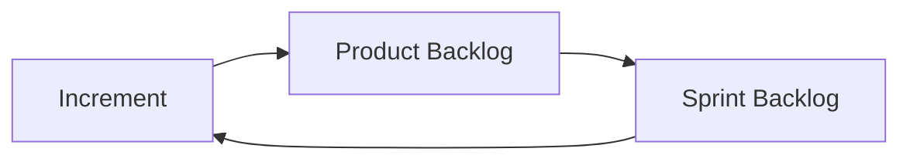

# Product Management and Scrum Framework

## Keywords

- empirical
- feedback loop

## Product Management and Three Vs

### Three Vs

iterate fast feedback loop

- Vision
  - creates *Transparency*
    - bc it forms the basis for all
      - following conversations
      - leading to a common understanding for
        - why you are building the product 
        - what your customers' needs are
    - provides a foundation and direction
- Value
  - defining value provides you with something to *Inspect*
  - the actual way to deliver value is only **Release**
    - faster feedback loop iteration needs more release
      - CI/CD
- Validation
  - causes *Adaption*
  - process validation
    - about *how* the scrum team is working
    - e.g. Sprint Retrospective
  - product validation
    - about *what* the scrum team is working
    - e.g. Sprint Review, marketplace feedback

## Four-keys

- Delivery Lead Time
- Development Frequency
- Mean Time to Restore
- Change Fail Percentage

use four-keys as just value-neutral metrics representing current status about the team, not for product validation

### Goodhart's Law

When a measure becomes a target, it ceases to be a good measure.

## Evidence-Based Management

### EBMgt Metrics

- Current Value
  - Revenue per Employee
  - Product Cost Ratio
  - Employee Satisfaction
  - Customer Satisfaction
- Time to Market
  - Release Frequency
  - Release Stabilization
    - the impact of poor development practices and underlying design and code base
  - Cycle Time
    - the time (including stabilization) to satisfy a key set of customers or to respond to a market opportunity competitively
    - = development time + stabilization time
  - On-Product Index
    - the time developers are allowed to work on exactly one initiative like a product
    - less context switching desired
- Ability to Innovate
  - Installed Version Index
    - the distribution of customers across the installed versions in production
    - the maintenance of the older versions has a negative impact on Ability to Innovate
  - Usage Index
    - determines how a product and its features are difficult to use and whether excess software is being sustained even though it is rarely used
  - Innovation Rate
    - growth of technical debt caused by poor designed and developed software
  - Defects

## Scrum

### Empirical Pillars of Scrum

- Transparency
- Inspection
- Adaptation
  - Sprint Planning
  - Daily Scrum
  - Sprint Review
  - Sprint Retrospective

### Scrum Roles

- Product Owner
- Development Team
- Scrum Master
- Stakeholder
  - uses, customers, investors, executives, compliance officers, etc.

### Scrum Artifacts

- Product Backlog
- Sprint Backlog
- Increment
  - releasable working product

### Scrum Events

- Sprint Planning
  - Sprint Goal
    - objective set for the Sprint that can be through the implementation of Product Backlog
    - provides guidance to Development Team on why it is building the Increment
    - created during the Sprint Planning
    - think about a Sprint Goal as a node of linked list toward Vision

### Reporting

- Velocity
  - don't forget the Goodhart's law
  - use just as a metric for planning
  - why use story point instead of actual days and hours?
    - there seems to be a study saying that the worst performing teams estimated in hours followed by the ones using no estimates

## References

- [The Professional Scrum Product Owner Book](https://www.scrum.org/resources/professional-scrum-product-owner-book)
